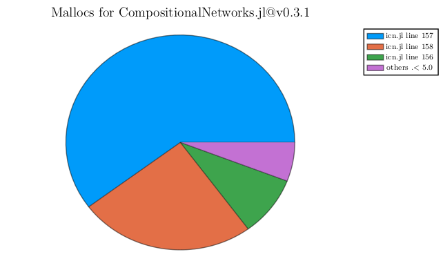

# PerfChecker

<!--[](https://mirage-interactive-fr.github.io/PerfChecker.jl/stable)
[](https://mirage-interactive-fr.github.io/PerfChecker.jl/dev)-->
[](https://github.com/Mirage-Interactive-Fr/PerfChecker.jl/actions)
[](https://codecov.io/gh/Mirage-Interactive-Fr/PerfChecker.jl)
[](https://github.com/SciML/SciMLStyle)
[](https://nohost.iijlab.net/chat/signup_user_complete/?id=nnuc1g14gtrqtnas6thu193xmr)
[](https://mirageinteractive.fr/)

`PerfChecker` is a set of performance checking tools for Julia packages. The ultimate aim is to create an environment where the tool can run similarly to a test environment. By doing so, it would be possible to test the performance of a package `P` in separate Julia instances. This would allow for each version of `P`:

- The use of the latest compatible versions of Julia and other dependencies of P
- Independence of compatibility requirements of `PerfChecker.jl` from the environment used during performance checks.

The `1.0.0-rc2` candidate keeps the existing `@check` interface and adds a
feature-oriented workflow with one fresh Malt worker per feature/version run.
The controller, web UI and plotting packages are not loaded in those measured
workers.

```sh
julia --project=path/to/PerfChecker bin/perfchecker.jl init --root=path/to/MyPackage
julia --project=path/to/MyPackage/perf path/to/PerfChecker/bin/perfchecker.jl run \
  --suite=path/to/MyPackage/perf/suite.jl --profile=ci \
  --reports=path/to/MyPackage/perf/results/ci
```

The same CLI provides `plan`, `preflight`, `compare`, `check`, `verify`,
`migrate`, `julia-campaign`, `network`, and `capabilities`. New run bundles are
digest-protected and remain consumable by REPL, CI, Documenter, Pluto, Makie,
WGLMakie and Oxygen adapters through the common query and plot grammar.

## Feature and software suites

PerfChecker can now define performance contracts per feature, map different
workloads to old API ranges, and combine direct dependencies into one software
surface. Each feature/version pair runs in a fresh Malt worker that does not
load PerfChecker or its UI dependencies.

```julia
feature = FeatureSpec(:parse_file; entrypoint = "perf/features/parse_file.jl")
package = PackageSuite("MyParser"; source = pwd(), environment = "perf/runner",
    versions = :all, features = [feature])
suite = SoftwareSuite(:my_software, [package])
result = run_suite(suite; profile = :ci)
write_suite_reports(result, "perf/results/ci")
```

The shared plan, asynchronous-job, result, property-corpus, JSON, Markdown,
JUnit, version-series/comparison, and portable run-bundle grammars are consumed by the optional Oxygen,
Pluto, Makie, DrWatson, Supposition, maintained PropCheck compatibility, and
PProf/FlameGraphs integrations. External command
providers can emit the same observations from Python, Rust, R, or a mixed
stack without loading PerfChecker in the measured process. `action.yml`,
`bin/perfchecker.jl`, `bin/perfchecker-suite.jl`, and
`bin/perfchecker-provider.jl` provide
the same workflow to CI without putting those controller dependencies inside
the measured workers. See the software-suite documentation for version windows,
dependency pins, and multi-package examples.

Terminal workflows use the same grammar through `filter_suite_plan`,
`configure_suite_repl`, and `run_suite_repl`: inclusive version bounds,
package/feature/backend filters, search, stable sorting, worker options, and a
run-count progress bar. Loading UnicodePlots adds `terminal_plot`. Loading
Documenter or DocumenterVitepress adds static performance pages and VitePress
builds from the same portable bundle; none of these UI packages enter measured
workers.

The candidate VS Code extension in `editors/vscode` is the local developer
cockpit. It presents package → business feature → check type → version in the
native Test Explorer and its visual editor, opens the exact workload script,
launches selected nodes with progress, and provides output/log icons at every
level. BenchmarkTools and Chairmarks distributions, version curves,
comparisons, allocation pies and typed flame graphs are interactive and
filterable. Named branches, tags and commits can be measured together, with
exact or grouped reference policies. Its saved `perfchecker-ui-config/1` file
also drives the CLI and Documenter blocks; it complements the Oxygen Studio
rather than replacing it.

PerfChecker also ships a non-recursive self-measurement suite in `perf/suite.jl`.
It exercises planning, bundle comparison and query execution in isolated
workers, including allocation attribution and CPU flame-graph evidence for the
comparison engine.

The Oxygen extension includes a responsive Performance Studio for selecting
semantic version ranges, filtering, colour-labelling, sorting, configuring and
launching feature/version runs, then exploring
their historical curves and regressions. It supports a loopback controller or
an authenticated hosted controller with pull-based local/remote agents; the
measured Malt workers remain free of PerfChecker and UI dependencies.

Visualization uses one `perfchecker-plot/1` grammar across interfaces. WGLMakie
provides interactive WebGL figures in Oxygen, GLMakie can open the same figures
locally, and CairoMakie exports CI artifacts. Available views include version
trajectories, sample distributions, regression deltas, time/allocation
trade-offs, allocations by source file, allocation hotspots by exact line, and
version-by-line heatmaps. Allocation shares are also available as percentage
pie charts. CPU sampling and allocation stacks can be explored as Makie flame
graphs, including Julia 1.12 wall-time task profiles, with version selection in
the same Studio. Every flame section has a full-path hover tooltip and a legend;
CPU views distinguish observed runtime dispatch, non-concrete inferred returns,
and garbage collection. Network-aware workloads can report explicit payload and
operation counters without sampling unrelated host traffic.

## Google Summer of Code (2023 archive)

In 2023, `JuliaConstraints`, which included `PerfChecker.jl` at the time,
participated in Google Summer of Code (GSoC) through the Julia language
umbrella. The original project lists are retained as historical context:

- [JuliaConstraints](https://julialang.org/jsoc/gsoc/juliaconstraints/)
- Other [Julia language projects](https://julialang.org/jsoc/projects/)

### Project Ideas

This package consists of a set of tools designed to check the performance of packages over time and versions. The targeted audience is the whole community of Julia package developers.

This README provides a short demo on how PerfChecker can be used.

**Basic features to implement (length ≈ 175 hours)**

- PerfCheck environment similar to Test.jl and Pkg.jl
- Sugar syntax `@bench`, `@alloc`, `@profile` similar to Test.jl and Pkg.jl
- Interactive REPL interface
- Interactive GUI interface (using for instance Makie)
- Automatic Profiling ? (not sure how, there already is a bunch of super cool packages)
- Automatic plotting of previous features

**Advanced features (length +≈ 175 hours)**

- *Smart* semi-automatic analysis of performances
- Performances bottlenecks
- Regressions
- Allocations vs speed trade-off
- Descriptive plot captions
- Handle Julia and other packages versions
- Integrates with juliaup
- Automatically generate versions parametric space for both packages and Julia

Note that some features are interchangeable depending on the interest of the candidate. For candidates with a special interest in the JuliaConstraints ecosystem, checking the performances of some packages is an option.

**Length**

175 hours – 350 hours (depending on features)

**Recommended Skills (||)**

- Familiarity with package development
- REPL and/or GUI interfaces
- Coverage, Benchmarks, and Profiling tools

**Difficulty**

Easy to Medium, depending on the features implemented

### Getting Started

`PerfChecker` was already designed as a standalone project. A good start is to understand fully its features and workflow by writing a small use case in the vein of the tutorial below. Possible packages could be

- A JuliaConstraints package or dependency
- A package written by the GSoC candidate
- Another package from the Julia community

Please bear in mind that, ideally, writing performance checks for such a package should be simple.

Also, allocation checks generate memory files in the package local folder. Ideally the package should be `dev`ed in a local environment.

To contribute today, please use the current repository issues and pull requests.


We encourage students and other possible GSoC contributors to participate in `PerfChecker`'s development as it would bring a tools for the Julia community as a whole. It would bring them experience and deep understanding of Julia packages development and, more generally, open source development along with performance testing.
We're looking forward for proposals submissions.

## Small tutorial

This tutorial is based on a beta version and is prone to change frequently. Please use it as a workflow example.

Let's write two small scripts to check allocations (`allocs.jl`) and benchmarks (`bench.jl`) for [CompositionalNetworks.jl](https://github.com/JuliaConstraints/CompositionalNetworks.jl) using `PerfChecker.jl`.
In the current state, we write and execute the scripts (and stores a local environment) in the `/perf` folder of `CompositionalNetworks.jl`. You can use `julia --project` to activate that environment when running the script. For instance, I run the check for `CompositionalNetworks.jl` with the following command,

```shell
julia -t 10 --project
```

To generate results from different versions of the targeted package, be sure to change the version in the local environment.

We will generate plots from the allocations check and the benchmark check from the `REPL`.

Please add to the environment the following packages (adapt to your use case):

- `PerfChecker.jl`
- `Test.jl`: for allocations
- `BenchmarkTools`: for benchmarks
- `CompositionalNetworks.jl`: target
- `ConstraintDomains.jl`: dependency

**Remark on code compilation and `PerfChecker.jl`**

Depending on the nature of your code, it is important to be sure to trigger all compilation previous to the allocation check. This role is annotated in both scripts.

Note that in the case of `CompositionalNetworks.jl`, it stochastically generates a great deal of methods to compile.

For deterministic code, `pre-alloc()` can be minimal, and `@benchmark` will handle triggering the necessary compilation before the checks.

### Allocation checks

The current state of `PerfChecker.jl` requires the use of `Test.jl`, but this requirement will disappear soon.

```julia
# Required to run the script
using PerfChecker
using Test

# Target(s)
using CompositionalNetworks # latest release: 0.3.1

# Direct dependencies of this script
using ConstraintDomains

@testset "PerfChecker.jl" begin
    # Title of the alloc check (for logging purpose)
    title = "Explore, Learn, and Compose"

    # Dependencies needed to execute pre_alloc and alloc
    dependencies = [CompositionalNetworks, ConstraintDomains]

    # Target of the alloc check
    targets = [CompositionalNetworks]

    # Code specific to the package being checked
    domains = fill(domain([1, 2, 3]), 3)

    # Code to trigger precompilation before the alloc check
    pre_alloc() = foreach(_ -> explore_learn_compose(domains, allunique), 1:10)

    # Code being allocations check
    alloc() = explore_learn_compose(domains, allunique)

    # Actual call to PerfChecker
    alloc_check(title, dependencies, targets, pre_alloc, alloc; path=@__DIR__, threads=10)
end
```

This script will output the table below (and store it as `mallocs/mallocs-0.3.1.csv`). Note that the allocations are provided in decreasing order. The `.mem` files generated by tracking allocations are automatically deleted (unless your code run into an error).


### Benchmark checks

As `BenchmarkTools.jl` provides already a great set of functionalities, we use it directly. In the future, it is likely that `PerfChecker.jl` will provide synthetic sugar to wrap `@benchmark` with similar behavior to make using `BenchmarkTools.jl` invisible.

```julia
# Required to run the script
using PerfChecker
using BenchmarkTools

# Target(s)
using CompositionalNetworks # latest release: 0.3.1

# Direct dependencies of this script
using ConstraintDomains

# Target of the benchmark
target = CompositionalNetworks

# Code specific to the package being checked
domains = fill(domain([1, 2, 3, 4]), 4)

# Code to trigger precompilation before the bench (optional)
foreach(_ -> explore_learn_compose(domains, allunique), 1:10)

# Code being benchmarked (be sure to enforce specific amounts of evals and samples for each version benchmarked)
bench = @benchmark explore_learn_compose(domains, allunique) evals=1 samples=10 seconds=3600

# Store the bench results
store_benchmark(bench, target; path=@__DIR__)
```

This script will output the results of `@benchmark` as a table (and store it as `benchmarks/benchmark-0.3.1.csv`). Note that it is recommended (but not necessary) to ensure that for each version of the package benchmarked, the output is of similar length.

### Visualization

We will generate some plots, in `perf/mallocs` and `perf/benchmarks`. In the REPL (or a notebook), please run:

```julia
using PerfChecker
using CompositionalNetworks

alloc_plot([CompositionalNetworks])
bench_plot([COmpositionalNetworks])

```

**Allocs (Pie Chart)**

For each version checked with the previous scripts, we get a pie plot showing the distribution of the allocations (per line). Obviously, improving the allocations at the 5th line of `metrics.jl` would improve allocations (and likely overall performances) in `CompositionalNetworks.jl`. Let's try to spot issues through the evolution of allocations over time.



**Allocs over time**

Luckily, an overview of the evolution of the allocations within each file is also plotted. The allocations in `CompositionalNetworks.jl` improve a lot from `v0.3.x`. Interestingly, the changes also introduced an increase in allocations in the `metrics.jl` file. Maybe there really is an issue (answer in future releases of `CompositionalNetworks.jl`).


First, we should check how the performances are impacted by the changes in memory allocations.

**Benchmarks (allocs and memory)**

To confirm the improvement of allocations above, let's have a look at the evolution of allocations and memory use over time.


Both distribution of allocations and memory is very stable. This meet the improvement of the design of `CompositionalNetworks.jl` that ensure allocations of one data structure at the start of each `explore_learn_compose` call evaluated by both scripts.

**Benchmarks (times and garbage collection times)**

Garbage collection brings a lot of comfort for programmers, and it participates in the attractiveness of the Julia language. However, careless allocations can be a performance pitfall. Such was the case of `CompositionalNetworks.jl` prior to `v0.3`.


The changes introduce from that version clearly improved our GC issues. Does it reflect on the global time performance? (spoiler: yes, it does, cf next plot)


We can remark important deviations (beware the logarithmic scale ...) from the mean. As mentioned above, `CompositionalNetworks.jl` uses a stochastic process, so it is not surprising. At least, memory (allocations) are stable.

**Benchmarks (evolutions overview)**

Well, we probably could get the gist of the previous 4 plots from the wrap-up plot below.


Note that the analysis on memory stability despite a stochastic process that reflect on the `times` and `gctimes` is not possible here. But it looks much better if you only can show off one performance plot.

## Contributing

We appreciate contributions from users including reporting bugs, fixing issues, improving performance and adding new features.

To contribute, please fork the repo, create a new branch, make your changes, and submit a pull request. If you are unsure about anything or need any help, please don't hesitate to ask.

## Acknowledgments

This package is maintained by [Mirage Interactive](https://mirageinteractive.fr/).
We thank the JuliaConstraints and wider Julia communities for their historical
and ongoing contributions.
