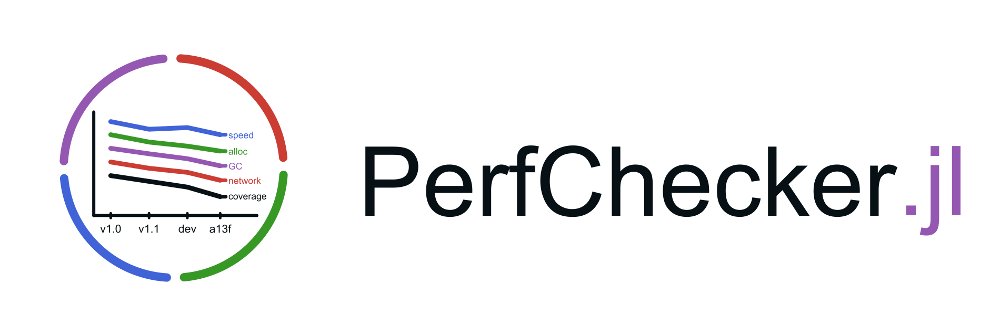

<p align="center">
  
</p>

[](https://mirage-interactive-fr.github.io/PerfChecker.jl/dev/)
[](https://github.com/Mirage-Interactive-Fr/PerfChecker.jl/actions)
[](https://codecov.io/gh/Mirage-Interactive-Fr/PerfChecker.jl)
[](LICENSE)
[](https://mirageinteractive.fr/)

PerfChecker is a performance-testing system for Julia packages and software
suites. It measures user-facing features in fresh Julia workers, compares
releases and development revisions, attributes regressions to source evidence,
and exposes the same result grammar to CI, VS Code, Oxygen, the REPL, Pluto,
Makie, Documenter, and automation agents.

PerfChecker keeps the controller and visualization stack outside measured
workers. A run loads only the target package, its workload, and the selected
measurement backend.

## What it provides

- one business feature with independently selectable timing, allocation,
  profiling, and network checks;
- comparisons across releases, a working tree, branches, tags, commits, and
  Julia stable, prerelease, or nightly runtimes;
- explicit compatibility windows when a feature did not exist in older
  versions;
- single-package and multi-package software suites;
- BenchmarkTools and Chairmarks distributions;
- allocation attribution by file, line, percentage, and stack;
- CPU, wall-time, and allocation flame graphs with dispatch, inference, and GC
  diagnostics when Julia exposes that evidence;
- application, interface, and isolated-process network byte and packet counts;
- portable integrity-protected bundles, JSON/JSONL, Markdown, JUnit, and
  interactive plots;
- a central VS Code interface, an Oxygen web studio, a guided REPL, Pluto,
  Makie/WGLMakie, and documentation integrations.

Code coverage is intentionally separate from these performance backends. The
badge above reports coverage from the ordinary CI test suite through
`julia-processcoverage` and Codecov.

## Quick start

Generate a performance workspace inside a Julia package:

```sh
julia --project=/path/to/PerfChecker.jl \
  /path/to/PerfChecker.jl/bin/perfchecker.jl init --root=/path/to/MyPackage
```

The generated layout is deliberately small:

```text
perf/
├─ Project.toml
├─ suite.jl
├─ features/
│  └─ parse_document.jl
└─ results/
```

A feature entrypoint defines setup and one operation:

```julia
using MyPackage

function perf_setup()
    fixture = joinpath(@__DIR__, "fixtures", "document.txt")
    return read(fixture, String)
end

perf_workload(input) = MyPackage.parse_document(input)
```

Setup runs before measurement. `perf_workload(state)` is the operation observed
by the backend. Keep fixtures deterministic and make the result observable so
the compiler cannot remove the work.

## One feature, every compute backend

The following suite declares one `parse_document` business feature and attaches
each Julia compute backend independently. Interfaces group these entries as one
feature with checkboxes; users do not see artificial features such as
`parse_document_allocations`.

```julia
using PerfChecker

const ENTRYPOINT = joinpath(@__DIR__, "features", "parse_document.jl")

function check(id, backend; options = Dict{Symbol, Any}(), julia_since = nothing)
    return FeatureSpec(
        id;
        workload = :parse_document,
        backend,
        entrypoint = ENTRYPOINT,
        comparison_key = "parse-document/v1",
        julia_since,
        options,
    )
end

features = [
    check(:parse_document_benchmark, :benchmark;
        options = Dict(:samples => 30, :evals => 1, :seconds => 1.0)),
    check(:parse_document_chairmark, :chairmark;
        options = Dict(:samples => 30, :evals => 1, :seconds => 1.0)),
    check(:parse_document_lines, :alloc;
        options = Dict(:targets => ["MyPackage"], :track => "user", :repeat => true)),
    check(:parse_document_cpu, :profile;
        options = Dict(:targets => ["MyPackage"], :profile_seconds => 1.0,
            :profile_delay => 0.001)),
    check(:parse_document_wall, :wall_profile;
        julia_since = v"1.12",
        options = Dict(:targets => ["MyPackage"], :profile_seconds => 1.0)),
    check(:parse_document_allocations, :profile_alloc;
        options = Dict(:targets => ["MyPackage"], :sample_rate => 1.0,
            :profile_repetitions => 10)),
]

package = PackageSuite(
    "MyPackage";
    source = normpath(joinpath(@__DIR__, "..")),
    environment = joinpath(@__DIR__, "runner"),
    versions = :all,
    include_dev = true,
    features,
)

build_suite() = SoftwareSuite(:my_package, [package])
```

### Compute backend guide

| Backend | What it measures | Typical use |
| --- | --- | --- |
| `:benchmark` | BenchmarkTools time samples, GC time, memory, and allocation count | Stable latency and regression gates |
| `:chairmark` | Chairmarks time, GC fraction, bytes, and allocations | Low-overhead measurement of short operations |
| `:alloc` | Bytes attributed to exact source files and lines | Line-level allocation investigation |
| `:profile` | CPU stack samples plus dispatch, inference, and GC markers | CPU flame graphs and source attribution |
| `:wall_profile` | Wall-time task stack samples on Julia 1.12+ | Waiting, scheduling, and asynchronous workloads |
| `:profile_alloc` | Sampled allocation bytes, counts, sites, and stacks | Allocation flame graphs and type-oriented diagnosis |

BenchmarkTools and Chairmarks are optional dependencies. Install the backend
you select in the suite's runner environment. Profiling backends use Julia's
standard `Profile` library.

## Network backends

Network checks use a separate entrypoint because an application-level workload
must report its own semantic counters:

```julia
using MyPackage

perf_setup() = MyPackage.Client("http://127.0.0.1:8080")

function perf_workload(client)
    request = MyPackage.encode_request()
    response = MyPackage.exchange(client, request)
    return (
        bytes_sent = sizeof(request),
        bytes_received = sizeof(response),
        operations = 1,
        connections = 1,
    )
end
```

Attach the three scopes as separate checks of the same business feature:

```julia
const NETWORK_ENTRYPOINT = joinpath(@__DIR__, "features", "exchange.jl")

network_features = [
    FeatureSpec(:exchange_application;
        workload = :exchange,
        backend = :network,
        entrypoint = NETWORK_ENTRYPOINT,
        comparison_key = "exchange/v1",
        options = Dict(:network_repetitions => 10)),
    FeatureSpec(:exchange_interface;
        workload = :exchange,
        backend = :network_interface,
        entrypoint = NETWORK_ENTRYPOINT,
        comparison_key = "exchange/v1",
        options = Dict(:network_interface => "auto", :network_repetitions => 5)),
    FeatureSpec(:exchange_isolated;
        workload = :exchange,
        backend = :network_isolated,
        entrypoint = NETWORK_ENTRYPOINT,
        comparison_key = "exchange/v1",
        options = Dict(:network_interface => "lo", :network_repetitions => 5)),
]
```

| Backend | Attribution | Interpretation |
| --- | --- | --- |
| `:network` | Counters returned by the workload | Precise for application payload and logical operations |
| `:network_interface` | Shared Windows or Linux host interface | Informative unless the interface and host are hermetic |
| `:network_isolated` | Worker group in a Linux network namespace | Suitable for attributed byte and packet budgets |

The isolated backend requires Linux namespaces directly or through WSL2. Probe
the host first and use `measure_isolated_network_command` when the complete
process tree, including child services, must be measured. Remote latency remains
contextual; byte and packet counts can be blocking CI evidence when attribution
is explicit. See [Network measurement](docs/src/network-measurement.md).

## Plan, run, and compare

Inspect compatibility and the exact run matrix before spending benchmark time:

```sh
julia --project=perf /path/to/PerfChecker.jl/bin/perfchecker.jl plan \
  --suite=perf/suite.jl --profile=quick

julia --project=perf /path/to/PerfChecker.jl/bin/perfchecker.jl preflight \
  --suite=perf/suite.jl --profile=ci \
  --output=perf/results/compatibility.json

julia --project=perf /path/to/PerfChecker.jl/bin/perfchecker.jl run \
  --suite=perf/suite.jl --profile=ci --reports=perf/results/ci \
  --progress=jsonl
```

Compare two portable bundles and fail when a declared budget is exceeded:

```sh
julia --project=perf /path/to/PerfChecker.jl/bin/perfchecker.jl check \
  --baseline=perf/bundles/stable --candidate=perf/bundles/change \
  --limit=julia.wall.time=0.05 --limit=julia.alloc.bytes=0.02 \
  --min-samples=10 --reports=perf/comparison
```

Released versions, the local working tree, Git branches, tags, commits, and
multiple candidate implementations can coexist in one plan. A feature can use
different entrypoints over explicit package-version windows when older releases
do not expose the same API.

## VS Code extension

The PerfChecker extension is the central graphical workspace. It uses the same
suite plan, `perf/perfchecker-ui.json`, and result bundles as the CLI, Oxygen,
and documentation integrations.

Its tree follows the actual domain model:

```text
package → business feature → check type → version or Git target
```

From the Test Explorer or PerfChecker activity view, you can:

- run a package, feature, check type, version, or arbitrary selection;
- watch progress and worker output;
- open the exact workload script behind a test brick;
- open the latest visual result at every relevant tree level;
- select check types independently for each business feature;
- filter and sort versions without dragging every card;
- add branches, tags, commits, repository URLs, and grouped comparison targets;
- configure exact or aggregated baselines;
- inspect BenchmarkTools and Chairmarks distributions, version trajectories,
  allocation pies and heatmaps, and interactive flame graphs;
- hover small plot elements for their complete metric, source line, or stack;
- save a shared configuration consumed by VS Code, Oxygen, and Documenter.

### Build and install the current VSIX

```powershell
git clone https://github.com/Mirage-Interactive-Fr/PerfCheckerVSCode.git
Set-Location PerfCheckerVSCode
npm ci
npm test
npm run package:pre-release -- --out perfchecker-vscode-0.9.0.vsix
code --install-extension .\perfchecker-vscode-0.9.0.vsix --force
```

Reload VS Code, open the package root, click the PerfChecker activity-bar icon,
and run **PerfChecker: Open visual suite editor** from the command palette. The
extension settings select the Julia executable, runner project, suite factory,
profile, report directory, and shared UI configuration.

The extension is developed and released independently from the
[PerfCheckerVSCode](https://github.com/Mirage-Interactive-Fr/PerfCheckerVSCode)
repository. Its stable Marketplace identity remains
`mirage-interactive-fr.perfchecker-vscode`. See the
[VS Code guide](docs/src/interfaces/vscode.md).

## Other interfaces

- **Oxygen:** hosted Performance Studio, authenticated controller, and
  pull-based local or remote agents.
- **Makie/WGLMakie:** interactive desktop, browser, and exportable CI figures.
- **REPL/UnicodePlots:** guided filtering, sorting, selection, progress, and
  terminal plots.
- **Pluto:** notebook dashboards backed by the same immutable plan.
- **Documenter/DocumenterVitepress:** declarative documentation blocks filtered
  by suite, package, feature, backend, metric, target, and artifact.
- **Agents and CI:** canonical JSON/JSONL, bounded queries, integrity metadata,
  JUnit, and explicit pass/fail policies.

Read the [complete documentation](https://mirage-interactive-fr.github.io/PerfChecker.jl/dev/)
for tutorials, report contracts, Julia runtime campaigns, external dependency
evidence, and hosted operation.

## Development

Run Julia tests without user startup files:

```sh
julia --startup-file=no --project=. -e 'using Pkg; Pkg.test()'
```

The VS Code client has its own TypeScript tests and release lifecycle in the
[PerfCheckerVSCode repository](https://github.com/Mirage-Interactive-Fr/PerfCheckerVSCode).

Bug reports, feature proposals, documentation improvements, and new measurement
providers are welcome through GitHub issues and pull requests. PerfChecker is
maintained by [Mirage Interactive](https://mirageinteractive.fr/) for the Julia
package ecosystem and is released under the MIT license.
