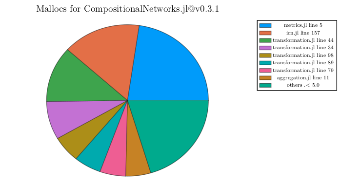

# PerfChecker

[](https://JuliaConstraints.github.io/PerfChecker.jl/stable)
[](https://JuliaConstraints.github.io/PerfChecker.jl/dev)
[](https://github.com/JuliaConstraints/PerfChecker.jl/actions)
[](https://codecov.io/gh/JuliaConstraints/PerfChecker.jl)
[](https://github.com/invenia/BlueStyle)

This is a small collection of semi-automated performance checking tools for Julia packages. The long-term goal is to have it run similarly than the test environment. The performances check of a package `P` would occur in independent instances of Julia that would allow for each version of `P`:

- Using the latest compatible versions of Julia and other dependencies of `P`
- Making `PerfChecker.jl` compatibility requirements independent of the environment used during performance checks.

## Small tutorial

This tutorial is based on a beta version and is prone to change frequently. Please refer to this `README` if your performance checking scripts stop to work.

Let's write two small scripts to check allocations (`allocs.jl`) and benchmarks (`bench.jl`) for [CompositionalNetworks.jl](https://github.com/JuliaConstraints/CompositionalNetworks.jl) using `PerfChecker.jl`.
In the current state, we write and execute the scripts (and stores a local environment) in the `/perf` folder of `CompositionalNetworks.jl`. You can use `julia --project` to activate that environment when running the script. For instance, I run the check for `CompositionalNetworks.jl` with the following command,
```shell
julia -t 10 --project
```

To generate results from different versions of the targeted package, be sure to change the version in the local environment.

We will generate plots from the allocations check and the benchmark check from the `REPL`.

Please add to the environment the following packages (adapt to your use case):

- `PerfChecker.jl`
- `Test.jl`: for allocations
- `BenchmarkTools`: for benchmarks
- `CompositionalNetworks.jl`: target
- `ConstraintDomains.jl`: dependency

**Remark on code compilation and `PerfChecker.jl`**

Depending on the nature of your code, it is important to be sure to trigger all compilation previous to the allocation check. This role is annotated in both scripts.

Note that in the case of `CompositionalNetworks.jl`, it stochastically generates a great deal of methods to compile.

For deterministic code, `pre-alloc()` can be minimal, and `@benchmark` will handle triggering the necessary compilation before the checks.


### Allocation checks

The current state of `PerfChecker.jl` requires the use of `Test.jl`, but this requirement will disappear soon.

```julia
# Required to run the script
using PerfChecker
using Test

# Target(s)
using CompositionalNetworks # lastest release: 0.3.1

# Direct dependencies of this script
using ConstraintDomains

@testset "PerfChecker.jl" begin
    # Title of the alloc check (for logging purpose)
    title = "Explore, Learn, and Compose"

    # Dependencies needed to execute pre_alloc and alloc
    dependencies = [CompositionalNetworks, ConstraintDomains]

    # Target of the alloc check
    targets = [CompositionalNetworks]

    # Code specific to the package being checked
    domains = fill(domain([1, 2, 3]), 3)

    # Code to trigger precompilation before the alloc check
    pre_alloc() = foreach(_ -> explore_learn_compose(domains, allunique), 1:10)

    # Code being allocations check
    alloc() = explore_learn_compose(domains, allunique)

    # Actual call to PerfChecker
    alloc_check(title, dependencies, targets, pre_alloc, alloc; path=@__DIR__, threads=10)
end
```

This script will output the table below (and store it as `mallocs/mallocs-0.3.1.csv`). Note that the allocations are provided in decreasing order. The `.mem` files generated by tracking allocations are automatically deleted (unless your code run into an error).


### Benchmark checks

As `BenchmarkTools.jl` provides already a great set of functionalities, we use it directly. In the future, it is likely that `PerfChecker.jl` will provide synthetic sugar to wrap `@benchmark` with similar behavior to make using `BenchmarkTools.jl` invisible.

```julia
# Required to run the script
using PerfChecker
using BenchmarkTools

# Target(s)
using CompositionalNetworks # lastest release: 0.3.1

# Direct dependencies of this script
using ConstraintDomains

# Target of the benchmark
target = CompositionalNetworks

# Code specific to the package being checked
domains = fill(domain([1, 2, 3, 4]), 4)

# Code to trigger precompilation before the bench (optional)
foreach(_ -> explore_learn_compose(domains, allunique), 1:10)

# Code being benchmarked (be sure to enforce specific amounts of evals and samples for each version benchmarked)
bench = @benchmark explore_learn_compose(domains, allunique) evals=1 samples=10 seconds=3600

# Store the bench results
store_benchmark(bench, target; path=@__DIR__)
```

This script will output the results of `@benchmark` as a table (and store it as `benchmarks/benchmark-0.3.1.csv`). Note that it is recommended (but not necessary) to ensure that for each version of the package benchmarked, the output is of similar length.

### Visualization

We will generate some plots, in `perf/mallocs` and `perf/benchmarks`. In the REPL (or a notebook), please run:

```julia
using PerfChecker
using CompositionalNetworks

alloc_plot([CompositionalNetworks])
bench_plot([COmpositionalNetworks])

```

**Allocs (Pie Chart)**

For each version checked with the previous scripts, we get a pie plot showing the distribution of the allocations (per line). Obviously, improving the allocations at the 5th line of `metrics.jl` would improve allocations (and likely overall performances) in `CompositionalNetworks.jl`. Let's try to spot issues through the evolution of allocations over time.



**Allocs over time**

Luckily, an overview of the evolution of the allocations within each file is also plotted. The allocations in `CompositionalNetworks.jl` improve a lot from `v0.3.x`. Interestingly, the changes also introduced an increase in allocations in the `metrics.jl` file. Maybe there really is an issue (answer in future releases of `CompositionalNetworks.jl`).


First, we should check how the performances are impacted by the changes in memory allocations.

**Benchmarks (allocs and memory)**

To confirm the improvement of allocations above, let's have a look at the evolution of allocations and memory use over time.


Both distribution of allocations and memory is very stable. This meet the improvement of the design of `CompositionalNetworks.jl` that ensure allocations of one data structure at the start of each `explore_learn_compose` call evaluated by both scripts.

**Benchmarks (times and garbage collection times)**

Garbage collection brings a lot of comfort for programmers, and it participates in the attractiveness of the Julia language. However, careless allocations can be a performance pitfall. Such was the case of `CompositionalNetworks.jl` prior to `v0.3`.


The changes introduce from that version clearly improved our GC issues. Does it reflect on the global time performance? (spoiler: yes, it does, cf next plot)


We can remark important deviations (beware the logarithmic scale ...) from the mean. As mentioned above, `CompositionalNetworks.jl` uses a stochastic process, so it is not surprising. At least, memory (allocations) are stable.

**Benchmarks (evolutions overview)**

Well, we probably could get the gist of the previous 4 plots from the wrap-up plot below.


Note that the analysis on memory stability despite a stochastic process that reflect on the `times` and `gctimes` is not possible here. But it looks much better if you only can show off one performance plot.


Help to solve the issue of making the script in `perf/allocs.jl` and not only `runtests.jl` is more than welcome. See issue #2

## A non-exhaustive list of expected features:
- [x] Automatic allocation check
- [x] Automatic Benchmark
- [ ] Automatic Profiling ? (not sure, there already is a bunch of super cool packages)
- [x] Automatic plots of previous features
  - [x] using commit/project version label
  - [x] allocations
  - [x] benchmark
  - [ ] profiling ? (See above)
- [ ] Independent environment for performance checks
  - [x] allocations
  - [x] benchmark
- [ ] Automatic environment selection based on
  - [ ] Julia compatibility: run the latest compatible Julia version available
  - [x] Dependencies' compatibility
- [ ] Sugar syntax and perfchecks options
  - [ ] wrap `@benchmark`
  - [ ] wrap `plot` from `Plots.jl` and `StatsPlots.jl`
- [ ] ML to generate (smells of a GSoC project?)
  - [ ] possible performances bottlenecks, issues, regressions
  - [ ] automatic captions for plots
